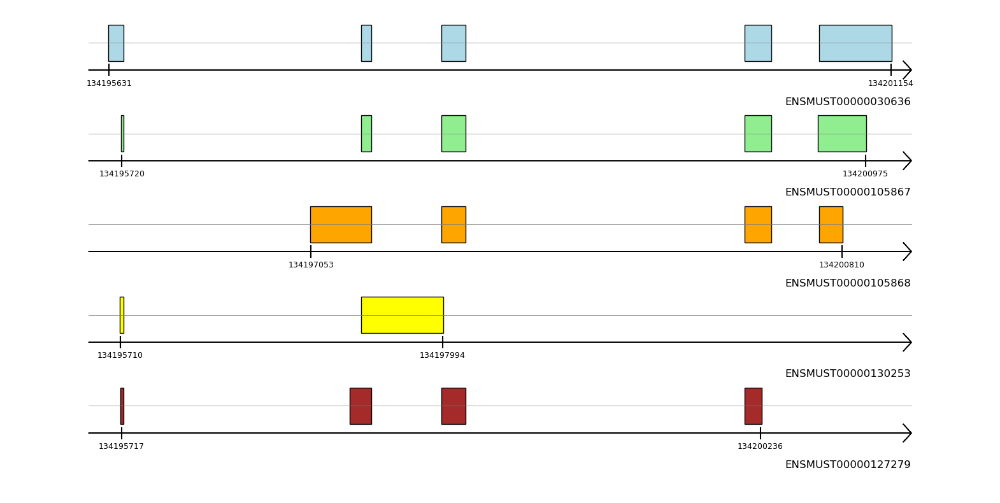

# alos


<!-- WARNING: THIS FILE WAS AUTOGENERATED! DO NOT EDIT! -->

## Install

``` sh
pip install alos
```

## Basic workflow

### Plot transcript module

``` python
import alos.plot_transcripts as ptr
```

Transcript’s structure can be visualized with draw_transcript function
from your own list of exons or directly by indicating a valid Ensemble
id. get_coord_from_tscrpt_id function takes a transcript’s Ensemble id
as an input and returns coordinates of exons and strand.

Multiple transcripts can be vizualized on one panel with the function
draw_transcripts_list

``` python
ptr.draw_transcripts_list(["ENSMUST00000030636", "ENSMUST00000105867", "ENSMUST00000105868", "ENSMUST00000130253", "ENSMUST00000127279"])
```



### Gene report module

plot_isoforms_summary is a nice way to build a basic summary of your
data. It summs up information on how many genes are expressed per cell
type, how many transcripts contains your dataset in general and reports
on how many genes are expressed by multiple isoforms.


Class mdata_m inherits muon data class and therefore has all the
operations available with muon data class. It has the following
methods: - filter_mdata: filters out the genes that are expressed by one
isoform only - iso_percent: percentage by which an isoform is expressed
in gene’s counts - plot_isoforms_summary - plot_genes_cell_type -
plot_isoforms_frequencies - plot_switch_gen_bar - draw_transcripts_list

``` python
mdata_test.plot_transcripts_per_cell_type('Cdk2ap1')
```


``` python
mdata_test.trsct_counts_cell_type('Cdk2ap1')
```


``` python
mdata_test.draw_transcripts_list('Pacsin1')
```


